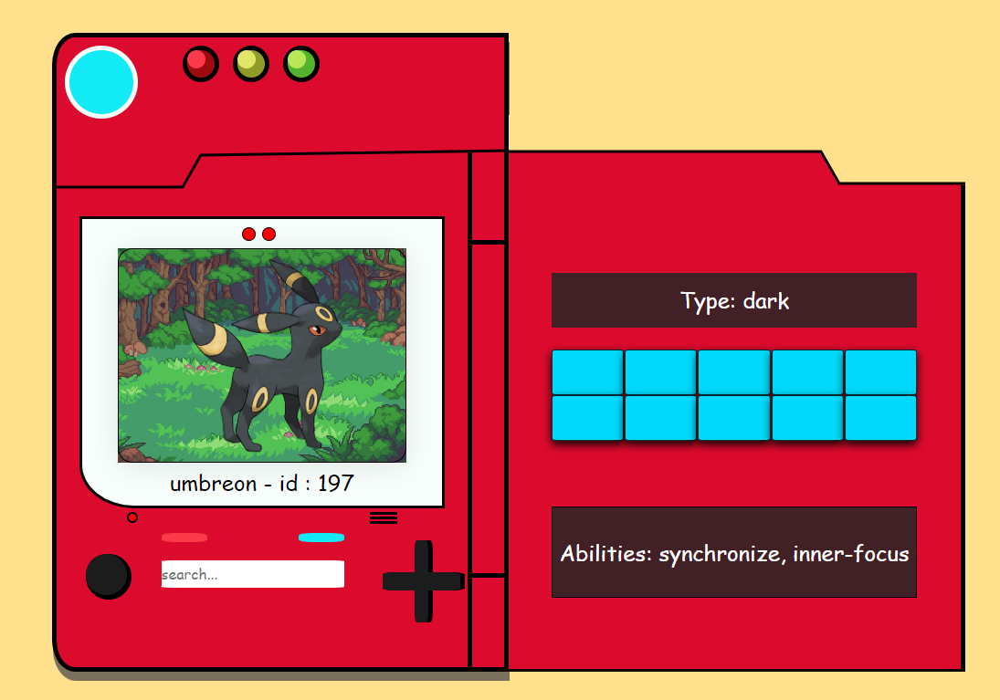

# Pokedex 

## Introduction 💡

I developed this Pokedex application as a personal project to improve my skills in HTML, CSS, and JavaScript. By building this interactive web application and integrating the PokeAPI, I aimed to strengthen my skills in front-end development and gain practical experience in working with external APIs. 

## Features ✨

1. Users can search for pokemons by typing the name or part of the name into the search field.
2. As the user types the pokemon's name, the Pokedex dynamically presents relevant suggestions in a dropdown list, offering a convenient selection of options.

## To-Do List 📋

1. Display More Pokemon Information
2. Apply final touches to CSS styling.
3. Add a "Random Pokemon" button

## Technologies Used 🖥️

- HTML 📄
- CSS 🎨
- JavaScript ⚙️
- [pokeAPI](https://pokeapi.co/) 🔗

If you'd like to connect with me or learn more about my work, feel free to visit my [Linkedin](https://www.linkedin.com/in/renato-luz-a1402b263/) profile 👋 

